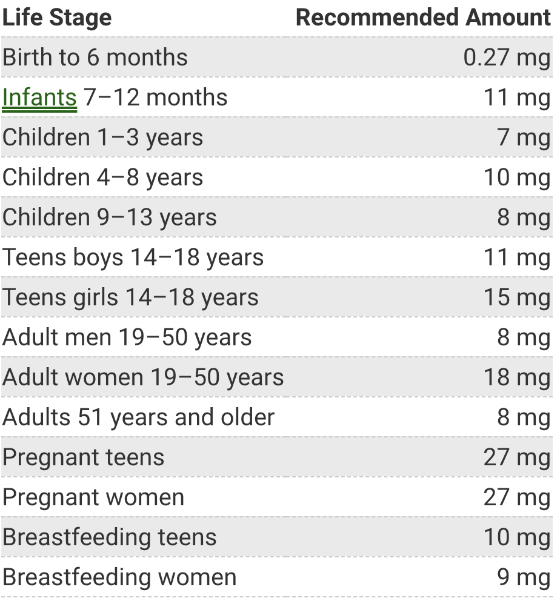

## Iron:

### Draft 1:
#### General Information

- It is a micronutrient, specifically a mineral which
is an inorganic nutrient. According to sidmartinbio.org, 
Inorganic nutrients are nutrients that don't have carbon 
in their structural makeup. 

#### Deficiency

##### Explanation & Causes
- Deficiency of iron causes anaemia in which 
there is not enough iron in the red blood cells 
and this causes lower transportation of oxygen 
throughout the body and this makes you tired, 
you feel very burnt, pale skin and breath 
shortness

- Vegan diets can lead to anaemia because 
they don't consume iron from non-vegan foods
and even if they consume Non-haem iron from 
vegtables, it is not as absorbed as the iron 
found in non-vegan foods

- Pregnancy can also cause anaemia as the 
woman has to share iron with the fetus so 
this is why pregnant women should also have 
a higher supply of iron in their diet

- Menstruation can also cause anaemia due to
a lot of iron being lost

- Growth spurts can also use up a lot of iron

- Bad absorption of iron could also be another 
cause for deficiencies of iron and this is because
you could have some intestinal diseases 

##### Fixes
- The best sources of iron are animal products 
according to the BBC
- It is also better to include vitamin C in 
your diet because it aids in the absorption 
of non-haem iron
- Babies need breast milk, if they don't get it,
their iron levels will be very low
- Don't drink a lot of tea and coffe since the 
phytates in it can bond with the iron before it is 
absorbed and that can get excreted

### Draft 2:

- Reread and fix
- Paraphrase

0. Basic Information:
- Iron is a mineral which is an inorganic micronutrient. 
What makes it inorganic is its structural makeup, organic
nutrients have carbon in their structural makeup while 
inorganic nutrients don't.

1. Common Names:
- The latin name for "Iron" is "Ferrum" which is the 
latin name for the element of Iron. It can be found 
on the periodic table with the letters "Fe" and its 
atomic number is 26 and its atomic mass is 55.84 AMU

2. Food Sources:
- Iron can be found in non-animal and animal products. 
Although, the iron found in non-animal products is 
non-haem iron which harder to absorb than the one
found in animal products which is haem iron.
To digest iron you need to get an intake of vitamin C 
as well importantly which can be found in. For example: 
red meat, liver, eggs, fish, these all contain haem 
iron while foods like: broccoli, fortified breakfast 
cereals, wholegrains all contain non-haem iron

3. Recommended Daily Dose:
[Table](./res/table.png)
- [Source](https://ods.od.nih.gov/factsheets/Iron-Consumer/)

4. How is it primarily excreted?
- According to, Biochemistry, Iron Absorption by Thomas Ems, 
Kayla St Lucia and Martin R. Huecker, "The mechanism of iron 
excretion is an unregulated process arrived at through loss 
in sweat, menstruation, shedding of hair and skin cells, and 
rapid turnover and excretion of enterocytes."

5. What function does it serve in the body?
- Iron is an essential mineral is for the growth
and development of the body. It is used for making
haemoglobin which is important for carrying oxygen 
to different parts of the body. 

6. Symptoms (Name of the deficiency)
- In the start when your body isn't getting enough iron
it starts using the iron which was stored in it, like in 
the bone marrow, the muscles and more body parts but then 
the long term effects of deficiency kick in and anemia is 
caused.

7. Long Term Effects of deficiency?
- Once the body has ran out of iron, a condition is caused, and
it is known as anemia. This condition causes you to get tired 
very quickly, your body also doesn't get enough oxygen, and 
you have shortness of breath. People with anemia also have 
more problems like, less concentration, shorter memory and 
the body is weaker and the chances of the body being able 
to fight off germs and bacteria is lower.

8. Causes of deficiency?  
- Vegan diets can lead to anaemia because 
they don't consume iron from non-vegan foods
and even if they consume Non-haem iron from 
vegtables, it is not as absorbed as the iron 
found in non-vegan foods

- Pregnancy can also cause anaemia as the 
woman has to share iron with the fetus so 
this is why pregnant women should also have 
a higher supply of iron in their diet

- Menstruation can also cause anaemia due to
a lot of iron being lost

- Growth spurts can also use up a lot of iron

- Bad absorption of iron could also be another 
cause for deficiencies of iron and this is because
you could have some intestinal diseases 

9. Fixes to deficiency?
- The best sources of iron are animal products 
according to the BBC

- It is also better to include vitamin C in 
your diet because it aids in the absorption 
of non-haem iron

- Babies need breast milk, if they don't get it,
their iron levels will be very low

- Don't drink a lot of tea and coffe since the 
phytates in it can bond with the iron before it is 
absorbed and that can get excreted

“Iron - Micronutrients – CCEA - GCSE Home Economics: Food and Nutrition (CCEA) Revision - BBC Bitesize.” 
BBC News, BBC, https://www.bbc.co.uk/bitesize/guides/zpt33k7/revision/8. 

“Iron Deficiency Anaemia - Priority Health Issues – CCEA - GCSE Home Economics: Food and Nutrition (CCEA)
Revision - BBC Bitesize.” BBC News, BBC, https://www.bbc.co.uk/bitesize/guides/zk92msg/revision/7. 

“Iron - Fact Sheet For Consumers.” NIH Office of Dietary Supplements, U.S. Department of Health and Human Services, 
https://ods.od.nih.gov/factsheets/Iron-Consumer/. 

Ems, Thomas. “Biochemistry, Iron Absorption.” StatPearls [Internet]., U.S. National Library of Medicine, 26 Apr. 2021, 
https://www.ncbi.nlm.nih.gov/books/NBK448204/. 

Fleming, Esther. “Home.” Sidmartinbio.org, 21 Mar. 2021, 
https://www.sidmartinbio.org/what-nutrients-are-organic-and-inorganic/. 

“Iron Deficiency Anaemia Symptoms and Treatments.” Illnesses & Conditions | 
NHS Inform, https://www.nhsinform.scot/illnesses-and-conditions/nutritional/iron-deficiency-anaemia. 

“Iron.” National Center for Biotechnology Information. PubChem Compound Database, U.S. National Library of Medicine, 
https://pubchem.ncbi.nlm.nih.gov/element/Iron. 

- [BBC Iron](https://www.bbc.co.uk/bitesize/guides/zpt33k7/revision/8)
- [BBC Iron Deficiency](https://www.bbc.co.uk/bitesize/guides/zk92msg/revision/7)
- [ODS Iron Consumer Factsheet](https://ods.od.nih.gov/factsheets/Iron-Consumer/)
- [Iron Absorption](https://www.ncbi.nlm.nih.gov/books/NBK448204/)
- [What Nutrients Are Organic & Inorganic](https://www.sidmartinbio.org/what-nutrients-are-organic-and-inorganic/)
- [Anaemia](https://www.nhsinform.scot/illnesses-and-conditions/nutritional/iron-deficiency-anaemia)
- [Iron The Element](https://pubchem.ncbi.nlm.nih.gov/element/Iron)

### Draft 3:

- Reread and fix
- Paraphrase

0. Basic Information:
- Iron is a mineral which is an inorganic micronutrient.
What makes it inorganic is its structural makeup, organic
nutrients have carbon in their structural makeup while
inorganic nutrients don't.

1. Common Names:
- The latin name for, "Iron" is, "Ferrum" which is the
latin name for the element of Iron. It can be found
on the periodic table with the letters, "Fe" and its
atomic number is 26 and its atomic mass is 55.84 AMU

2. Food Sources:
- Iron can be found in non-animal and animal products.
Although, the iron found in non-animal products is
non-haem iron which is harder to absorb than the one
found in animal products which is haem iron.
To digest non-haem iron you need to have a food source 
for vitamin C. Haem iron can be found in: 
red meat, liver, eggs, fish, while foods like: broccoli, 
fortified breakfast cereals, wholegrains all contain 
non-haem iron

3. Recommended Daily Dose:

- [Source](https://ods.od.nih.gov/factsheets/Iron-Consumer/)

4. How is it primarily excreted?
- According to, Biochemistry, Iron Absorption by Thomas Ems,
Kayla St Lucia and Martin R. Huecker, "The mechanism of iron
excretion is an unregulated process arrived at through loss
in sweat, menstruation, shedding of hair and skin cells, and
rapid turnover and excretion of enterocytes". This means that
there are multiple ways that iron could be excreted, one of which
is through shedding of hair and skin cells.

5. What function does it serve in the body?
- Iron is one of the most important minerals needed for the growth
and development of the body. It is used for making
haemoglobin which carries oxygen in the blood which then 
goes throughout the body supplying each part with oxygen.

6. Symptoms (Name of the deficiency)
- In the start when your body isn't getting enough iron
it starts using the iron which is stored in it, like in
the bone marrow, the muscles and more body parts but then
the long term effects of deficiency kick in and anemia is
caused.

7. Long Term Effects of deficiency?
- Once the body has ran out of iron, a condition known as 
anemia is caused. Due to this condition, you get tired
very quickly, your body also doesn't get enough oxygen, and
you have shortness of breath. People with anemia also have
more problems like, less concentration, shorter memory and
the body is weaker and the chances of the body being able
to fight off germs and bacteria is lowered.

8. Causes of deficiency?
- There are multiple things that can cause
iron deficiency such as vegan diets, pregnancy,
menstruation, growth spurts, bad absorption of iron. 
I will go into detail about each. Firstly, in vegan
diets, the only iron a vegan person can eat would be
non-haem which is harder to absorb than haem iron and 
this could cause iron deficiency. Secondly, in pregnancy,
the female has to share iron with the fetus and this amount
increases as time goes by as well, so this is why a female
should also have more intake of iron when she is pregnant. 
Thirdly, in menstruation, anemia could be caused due to 
the loss of iron. Fourthly, growth spurts can use up a 
lot of iron so you want to have a decent source of iron
if you are going through one. Finally, bad absorption of iron
could be another cause for anemia as you could have intestinal
diseases that cause you to not be able to absorb as much iron
as you could without the disease. Another reason of iron 
deficiency could be high intake of coffee or tea as they 
include a nutrient known as phytate that can bond with iron
and instead of the iron getting absorbed, it is excreted through
faeces.

9. Fixes to deficiency?
- To get rid of iron deficiency, first off, 
you want to start eating foods that contain iron. 
If you are a vegan, you want to start eating foods
that contain iron and some other foods that contain 
vitamin C so that it is easier to absorb the non-haem
iron from vegan food sources. If you drink a lot of 
coffee and tea, decrease the amount of coffee and 
tea that you drink.

“Iron - Micronutrients – CCEA - GCSE Home Economics: Food and Nutrition (CCEA) Revision - BBC Bitesize.”
BBC News, BBC, https://www.bbc.co.uk/bitesize/guides/zpt33k7/revision/8.

“Iron Deficiency Anaemia - Priority Health Issues – CCEA - GCSE Home Economics: Food and Nutrition (CCEA)
Revision - BBC Bitesize.” BBC News, BBC, https://www.bbc.co.uk/bitesize/guides/zk92msg/revision/7.

“Iron - Fact Sheet For Consumers.” NIH Office of Dietary Supplements, U.S. Department of Health and Human Services,
https://ods.od.nih.gov/factsheets/Iron-Consumer/.

Ems, Thomas. “Biochemistry, Iron Absorption.” StatPearls [Internet]., U.S. National Library of Medicine, 26 Apr. 2021,
https://www.ncbi.nlm.nih.gov/books/NBK448204/.

Fleming, Esther. “Home.” Sidmartinbio.org, 21 Mar. 2021,
https://www.sidmartinbio.org/what-nutrients-are-organic-and-inorganic/.

“Iron Deficiency Anaemia Symptoms and Treatments.” Illnesses & Conditions |
NHS Inform, https://www.nhsinform.scot/illnesses-and-conditions/nutritional/iron-deficiency-anaemia.

“Iron.” National Center for Biotechnology Information. PubChem Compound Database, U.S. National Library of Medicine,
https://pubchem.ncbi.nlm.nih.gov/element/Iron.

- [BBC Iron](https://www.bbc.co.uk/bitesize/guides/zpt33k7/revision/8)
- [BBC Iron Deficiency](https://www.bbc.co.uk/bitesize/guides/zk92msg/revision/7)
- [ODS Iron Consumer Factsheet](https://ods.od.nih.gov/factsheets/Iron-Consumer/)
- [Iron Absorption](https://www.ncbi.nlm.nih.gov/books/NBK448204/)
- [What Nutrients Are Organic & Inorganic](https://www.sidmartinbio.org/what-nutrients-are-organic-and-inorganic/)
- [Anaemia](https://www.nhsinform.scot/illnesses-and-conditions/nutritional/iron-deficiency-anaemia)
- [Iron The Element](https://pubchem.ncbi.nlm.nih.gov/element/Iron)

