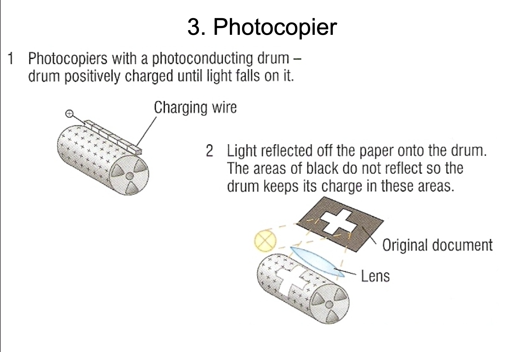

# Semester 1
- LE = Learning Engagement

## Unit 1: Energy
- GPE is the amount of energy a project has because of its position 
above the ground
- The GPE depends on the mass and how high above the person is
- GPE (j) = mass (kg) * gravitational field strength (newtons/kg) * height (m)
- Usually the gravitational field strength on Earth is 10 N/kg
- Kinetic energy is the energy an object has because it is moving
- KE (j) = 1/2 * mass (kg) * velocity^2 (m/s)
- Always rearrange these to find something like the mass or 
something:
    - m = (2KE / v^2)
    - v = sqrt(2KE / m)

- miles to km
- Speed has the greatest effect on a moving object
- Doubling mass = Doubling KE but Doubling speed/velocity = Quadrupling KE
- Energy cannot be created nor destroyed, only transformed 
- Because of the law of conservation of energy, as GPE is lost,
KE is gained when an object is falling
- Gravitation field strength is the strength of gravity in a
particular location
- Power = Work Done / Time Taken
- Work Done = Energy Transferred
- Work done against friction causes heat
- Work Done (joules) = Force (newtons) * Distance Moved (metres)
- Weight = mass (kg) * 10 (newtons/kg)
- Gain of KE = loss of GPE
- Power (Watts) = Work Done (Joules) / Time Took (Seconds)
- One Watt == One Joule Per Second
- Power is also = Energy Change / Time
- Power is the measure of how quickly a device does work
- The power of a device is also equal to the rate at which a device 
transforms energy from one form to another
- One Kilowatt motor performs 1000 joules of work per second
- If there is no specific air resistance, because of the law of
conservation of energy, the GPE is converted into KE
- Independent Variable = the thing you change, I.E. height of ball 
- Dependent Variable   = the thing you measure, I.E, the depth of
crater
- Controlled Variables = things you keep the same for accuracy
- Outliers exist bruh
- To calculate outliers, use (Q_one - 1.5IQR, Q_three - 1.5IQR) 
- If you see outliers, be sure to do the experiment/trial again

## Unit 2: Digestion And Excretion
### Digestive System:
- Basic, ingestion = taking in food, digestion = breaking down of
food, 2 types mechanical and chemical

- Starts with teeth, the teeth aid in increasing the surface
area of the food by physically breaking it down
- Whilst the teeth are increasing the surface area of the food,
the salivary glands release saliva which contains an enzyme 
known as amylase and it breaks down starches. Also lubricates
the food
- Then the esophagus carries the bolus (food) from the mouth to
the stomach (peristalsis)
- The stomach churns and mixes the bolus, it also produces 
hydrochloric  acids, secretes pepsin (breaks down protein) and 
there is also mucus which lubricates and protects the stomach walls
- Then the stomach sends the bolus into the small intestine where
most of the digestion takes place. The intestine is divided into 3 
parts, the duodenum, the jejunum and ileum. In each part something
different is absorbed, the duodenum, absorbs iron, the jejunum 
absorbs sugars, amino and fatty acids. Finally, the ileum absorbs
the vitamin B12, bile acids and some other nutrients. Most of the
absorption takes place in the jejunum. The small intestine also has 
small hair-like projections along the small intestine known as
villi. They increase the surface area of the intestine therefore 
increasing the absorption of chemicals in the food. The small 
intestine is about 20 ft long and ~3 cm in diameter. 
- Once the food has gone through the small intestine it goes 
through the large intestine or the colon where it removes excess 
water from undigested mterial, reabsorption, only a bit though, 
depends on how hydrated the body is though. The large intestine 
is about 5 ft long and 3 inches in diameter
- Then the food goes to the rectum and is excreted through the 
anus as faeces. 
- There are 3 organs that are part of the digestive system but 
not the tract, these are the liver, gall bladder and pancreas. 
The liver is where bile is produced, it is loaded with lipids
and salts, and it dissolves and disperses droplets of fats found
in food. Then gall bladder, stores bile and is attached to the
liver and small intestine and it also absorbs water. Then there
are the pancreas, they produce enzymes such as amylase, which,
breaks down starch, nuclease, which, breaks down the nucleus of 
the cells from the food, lypases, which, break down lipids, and 
protinases which break down proteins. These enzymes break down
carbohydrates, proteins, lipids and nucleic acids. It also produces 
sodium bicarbonat which neutralizes stomach acid. Also produces
insulin, which regulates blood sugar. The gall bladder also drips
the bile into the small intestine.
    
### Excretory System: 
- Homeostasis is the regulation of a stable internal environment in 
the body. 
- Osmoregulation is how the body gets rid of the stuff it does not
need.
- These processes happen as long as we are alive
- When the body is breaking down proteins, ammonia is produced
- Water is also very important for making urea which is CO2 + NH3 
- It is made up of the bladder [NOT THE GALL BLADDER], 
urethra, kidneys and ureter and skin and lungs. 
- Each cell in the body makes metabolic waste
- Urea is produced when amino acids are used for energy 
- We have 2 kidneys the size of fists in a bean shape located on 
either sides of the spinal column
- Waste filled blood enters kidney through renal artery
- As blood goes through, urea, excess water and other wastes
are removed and collected as urine
- Clean, filtered blood is returned to circulation through renal 
vein
- Nephrons is the main filtering unit, 1 million in each
- Blood enters nephron folowing into a small network of capillaries 
known as glomerulus
- Glomerulus is encased in a cup-shaped structure called the
Bowman's capsule. Blood is under pressure, 
the capsule is semi-permeable and fluid moves from blood into 
capsule. 
- Fluid contains water, urea, glucose, salts. No protein,
cells or platelets.
- Amino acids and glucose are return to blood stream by active 
transport
- 99% of water in Bowman's capsule returns to bloodstream
- Material remaining in nephron is called urine
- Ammonia & Urea is found in urine
- Urine flow through the ureter to the urinary bladder
- Urine is stored in bladder then released though the urethra
- Urinary Bladder:
    - Expands
    - Holds 0.6L of water
    - Larger in males than females
    - Humans produce 1.5 to 2.3L of urine every day
- The system starts with kidneys and they maintain
levels of water and dissolved materials and control
blood pressure. It filters out the fluid in the blood
and then 99% of it gets reabsorbed and 1% is peed
out. Use nephrons (1 million in each), they stretch
over 80 km, blood from heart enters kidneys from 
renal arteries and it is forced into a tangle of 
porus capillaries known as glomerulus. Starting point
for 1 nephron and the pressure is high enough to
squeeze out some of the blood into bowman's capsule
and the stuff squeezed out is called filtrate (made of
sodium, glucose, urea, water). Larger proteins 
do not get fildtered. Then the filtrate goes to 
proximal convoluted tubule. This is where  
osmoregulation and the water is reabsorbed and 
dissolved materials and a balance is created. 
Then the filtrate enters Loop of Henle which is 
a long hair pinned shaped tubule that passes thorugh
the 2 layers of the kidneys, first the renal cortex
and then the renal medulla. In the loop it extracts
most of the water we need, pumps out
salt we need and it makes the medulla more salty and 
this allows the water to be reabsorbed. The tissue
of the medula is also very salty as well and the 
lower you go, the saltier it gets. The filtrate 
then enters the second convoluted tubule and this is 
where regulation of potassium, sodium and calcium. 
Membranes porusness changes stuff. Once in the bladder
it just stays there until we piss

### Nutrients:
- Water:
    - Makes up bulk of blood
    - 90% of blood is made of water
    - Also makes up lymph, which is fluid that has been
    seeped out of the capillaries
    - 60 - 76% of body = water
    - Acts as shock absorber in spine
    - Used to flush waste
    - Urine should be mostly clear, which shows you are
    hydrated
    - Lubricates the joints
    - Lost through sweat glands, respiration, excretion
    - Makes sure osmosis works correctly in cells
    - Makes plasma
    - 2-3 Liters at least 

- Carbohydrates:
    - Main source of energy for the body
    - Absorbed in the bloodstream
    - Ones that aren't immediately used are converted
    into glycogen and stored in liver and skeletal 
    muscles
    - Simple -> Monosaccharides, Disaccharides
    - Complex -> Polysaccharides
    - 3 types:
        - Monosaccharides => Glucose, Fructose, Galactose from 
        fruits
        - Disaccharides   => Maltose, Lactose, Sucrose from sweets
        - Polysaccharides => Starches, Fibers, Glycogen from normal 
        food
    - Indigestiable carbs:
        - Commonly known as fiber
        - Celluose => Helps muscles to keep food and wastes moving
        through digestive and excretory systems
        - Starch, contained in breads, pasta, cereal, rice

- Protein is made up of 20 amino acids, some of them can't be made
by the body
- Calorie is the amount of energy in joules needed to heat up 1 cm
cubed of water by 1 degrees Celsius 
- 1 calorie = 4.186 joules 

- Calorie:
1. Any of several approximately equal units of heat, each measured
as the quantity of heat required to raise the temperature of 1 gram 
of water by 1°C at 1 atmosphere pressure.

2. The unit of heat equal to 1/100 the quantity of heat required
to raise the temperature of 1 gram of water from 0 to 100°C at 1
atmosphere pressure.

3. The unit of heat equal to the amount of heat required to raise
the temperature of 1 kilogram of water by 1°C at 1 atmosphere 
pressure.

4. A unit of energy-producing potential equal to this amount of
heat that is contained in food and released upon oxidation by the 
body.  

5. the gram calorie or small calorie, a non-SIunit of energy, 
equivalent to approximately 4.2 joules. This unit was widely 
used in chemistry and physics, being the amount of energy needed
to raise the temperature of 1 gram of water by 1 °C. 

6. kilogram calorie or large calorie. A unit of energy 1000 times 
larger than the gram calorie. It is equivalent to the gram
kilocalorie, approximately 4.2 kilojoules.

- Protein:
    - Supply materials for growth and repair of things like skin 
    and muscle
    - Regulatory and transport functions
    - Made of 20 possible amino acides and the body produces 12 of 
    them, remaining 8 are consumed, they are also known as essential
    amino acids

- Vitamins:
    - Organic molecules that help regulate body processes (carbon
    based)
    - 2 kinds, water soluble and fat soluble
    - Vitamin deficiencies can cause lethal damage
    - Vitamin A, retains the retina in the eye
    - Vitamin C, sticks together cells lining surfaces to make 
    connective tissues
    - Vitamin D, helps bones absorb calcium

- Fats AKA Lipids: 
    - Saturated & Unsaturated
    - Must be consumed to survive since our bodies can't make 
    enough of it
    - Protects body organs
    - Stores energy
    - Produces cell membranes
    - Produces certain hormones
    - Absorbs some vitamins

- Minerals:
    - Inorganic nutrients (elements off of the periodic table)
    - Calcium for bones
    - Iron for carrying oxygen
    - Magnesium nerve and msucle function
    - They are not digested but they are lost in sweat, urine and 
    other wastes
    - Replaced only through food intake

- The most energy that produces is fat:
    - Carbohydrates = 4 cal/gram
    - Proteins      = 4 cal/gram
    - Fat           = 9 cal/gram

- The food becomes a bolus once it becomes chewed and mixed with
saliva
- Chyme is the food exiting the stomach
- Increasing the surface area is good and that is why you break
down the food

- Mechanical Digestion:
    - Teeth
    - Stomach
    - Perisalsis

- Chemical Digestion:
    - Mouth
    - Stomach
    - Small Intestine

- Mucus protects the stomach from the hydrochloric acid

### Sources Of Foods: 
    - Macro nutrients
    - carbohydrates = sugar 
    - proteins = meats, beans
    - fats / lipids = meat, oils
    - nucleic acids = DNA, RNA 

### Get Some Diagrams Of:
    - Digestive System
    - Intestines
    - Excretory System 
-  
-  
- 
- 

## Unit 3: Electricity

- Static electricity is the charge made
by stationary friction due to differently 
charged substances or something

- Current can happened due to the movement
of negatively charged subatomic particles
called electrons through wires or the 
movemend of charged molecules by ions.

- There is a relationship between electricity
and magnetism

- Francis Hauksbee found out that spinning 
a glass globe produces electricity in the
early 1700s

- Stephen Gray & Granville Wheler discovered
that electricity could be communicated over
distances by contact.

- Nerves work based off electricity in our 
bodies.

- Copper & Zinc discs separated by a cloth
or cardboard and this generates electic 
current.

- Electric currents produce magnetic fields
- 2 parallel electified wires attract each 
other if the current flows in the same 
direction and repels in the other one.

- Amperes law, the force between currents 
was inversely propotional to distance between
them and proportional to the intensity of the
current flowing in each.

- Current between 2 points is also proportional
to the voltage or potential difference between 
them

- It can also be measured in joules per coulomb
- 

- I = V/R:
    - I -> Current    (Amps)
    - V -> Voltage    (Volts)
    - R -> Resistance (Ohms)

- Faraday made electric magnetic motor,
caused due to magnets around an electified
wire. 

- He also said, the generation of electricity 
in one wire via the changing magnetic field 
created by the current in another. Basis for
electromagnetic technologies nowadays.

- The electricity created by magnetic 
induction, the electricity produced by 
a voltaic batter, and good old static
electricity were all the same phenomenon.

- He also theorized thaat electromagnetic 
waves travel at the speed of light, and 
that light must exist in the same medium
as electical and magnetic energy.

- J.P. Morgan's money was used by Edison
and he worked on the longest lasting filament
bulb. 

- His bulb used DC (bad safety and efficiency)

- Edison only improved on the bulbs

- Conductors and insulators, metals are all conductors
- Conductors are the things that allow electric current to pass
through it easily. 
- Insulators are resistant to electricity
- Insulators are the things that cannot carry electric current
but can cause static electricity
- When you rub 2 insualators, electrons are pased from A to B
- Electric charge can be postive or negative
- The positive and negative charge of an atom is the same
- Atoms are uncharges due to the above
- Opposites attract and like repel
- Static electricity describes situation of objects that are 
stationary best with insulators as well
- Current occurs when charge moves from A to B, best with 
conductors
- When certain insulators are rubbed against each other, 
they get charged
- Electrons move and protons stay stationary in an object
- The material that gains the negative charge becomes negatively
charged
- The material that loses the negative charge is left with an
equal positive charge
- When uncharged and charged objects come together they attract
- Different charge attracts and same charge repels
- The main danger of static electricity is a spark which can
blow things up
- When oil/petrol is pumped, there can be a spark and boom, 
an explosion at the petrol station
as the spark is also able to burn the fuel as there is oxygen
in the air
- In operating rooms, it is vital that doctors don't become 
statically charged
because some of the gases in the room can cause explosions as
well and that is why antistatic floors are used which are made
of conductors
- Applications of this static electricity are paint spraying,
ink-jet printers, photocopiers and smoke precipitators

- ***COPY PASTED***
- The spray nozzle is connected is connected to the positive
terminal of an electrostatic generator. As the paint droplets
leave they repel each other and spread out to form a fine cloud
of paint. The metal panel to be painted is connected to the 
negative terminal. The negatively charged metal panel attracts
the positively charged paint.

- Spots of ink are given an electric charge as they leave the 
ink nozzle. The deflecting plates cause the drops to hit the
right part of the paper. The charges on the deflecting plates
change many times per second so that each drop
hits the paper in a different position.

- 
- 
- 

- **ANSWER QUESTIONS**

2. Lightning is caused by the moving of frozen raindrops through the
air and when they bump into each other this results in electric 
charge. This happens and happens eventually causing the whole cloud
to be filled with electric charge. The positive charge is stored at 
the top of the cloud and the negative is stored at the bottom. As 
most of you know, opposite charges attract, the ground beneath the
cloud builds up a positive charge. The ground’s electric charge then
focuses on anything that sticks up like humans. The charge coming
from these points connects with the charge coming from the clouds
and this becomes lightning. There are many types of lightning like
Sheet lightning, Fork lightning, Heat lightning, St. Elmo’s Fire,
Ball lightning and Sprites and many more……

3. The most dangerous thing about lightning is that no one knows 
where it is going to strike and that is why it is said that you 
should stay indoors and turn off any electronic equipment in your
house so you stay safe. To stay safe you should stay away from
water and stay away from conductive equipment like outlets and other
metals. Also try to stay away from open fields and hilltops because
these places have the highest probability of charge building up and
avoid contact with the ground. Don’t stand under trees or other 
high  objects. To keep your house safe you can buy lightning rods.
Avoid showers, keep your windows closed and turn off any electronics
and stay away from them. If you are in a car put both of your hands 
on your lap, keep the windows shut and avoid contact with car and 
don’t touch the radio or something and also pull to the side of 
the road.

- 1a(I):  The cloth becomes negatively charged and the perspex rod 
becomes positively charged
- 1a(II): The cloth becomes positively charged and the rod becomes 
negatively charged
- 1b(I):  They attract because of the charge
- 1b(II): The charge is negative
- 1c(I):  Due to them being samely charged
- 1c(II): Due to them being oppositely charged
- 2a:     By rubbing a cloth with it
- 2b:     Negative and Positive
- 2c:     Yes, because the different types of materials allow
electrons to be either transferred or received 
- 2d:     Repel
- 2e:     We can rub some cloth on 2 rods of different materials 
and then put them near each other to see what
happens, if they repel, they have same charge
otherwise unlike charge
- 2f:     Their atoms
- 2g:     The electrons can be transferred from one atom to another 
causing one to be negative charged and the other to be positive
- 3:  i   The hair are repelling because of them having the same
charge
- 3:  ii  Because it is an insulator and does not allow the
electricity go to the earth
- 3:  iii Hair would not stand up

- Electric current is the rate of flow of electric charge
- Electric current of one amp flows when a charge of one coulomb
passes a point in an electric circuit in one second

- In metallic conductors, electrons carry negative charge from the 
negative side of a power supple around a circuit and then back into
the positive side.

- Electric charge = current * time
- Q = IT
- Q is the electric charge (coulombs), I is the current (amps) and 
T is the time (seconds)

- Voltage of a battery is equal to the energy in joules 
provided when a charge of one coulomb passes through the 
battery
- In series, the voltage is divided amongst, in parallel 
the voltage stays the same as the start

- Voltage = Energy / Charge
- Voltage is the energy transferred per unit of charge 
- Current is the rate of flow of charge 
- 1 volt is the same as 1 joule per coulomb
- Electric current only flows if the circuit is complete, unbroken
and contains a power supply

- P = VI
- Power (Watts) = Voltage (Volts) * Current (Amps) 
- P = I * I * R
- Power (Watts) = Current (Amps) * Current (Amps) * Resistance (Ohm) 

- Current goes negative to positive

- If circuit components are connected in such a way that 
the current goes through each one linearly, this is a 
series circuit and all the components can be controlled
by one switch. The components also share the voltage of the 
power supply and with each bulb that is added, the previous
one gets dimmer because there is more energy being shared. 
They share the same current

- Series circuits:
- 

- Parallel circuits:
- 

- As you can see, in a parallel circuit, we can 
have individual switches to control each bulb as well, 
if we break the connection of one bulb, the other one 
will still work. They also allow the bulbs to be more
brighter than in a series circuit. They have the same
voltage.

- The total current is the sum of the currents through
the separate components. 

- Circuit symbols:
- 
- 
- 
- 
- 
- Coulomb = 6.2 * 10^18

- Benjamin Franklin was the one who said current moves positive to
negative
- [Conventional Current]
- Electroscope is that thing that opens up or something [from like that static electricity lesson]

- Resistance is the opposition to the flow of charge and is measured in ohms, also known as voltage.
- R (Ohms) = V (Volts) / I (Amps)
- To determine resistance, you need is a power supply, a variable resistor, test resistor, and 
ammeter and voltmeter. Varying the variable resistor, slowly the voltage increases, the current
also increases and the slope of this linear graph is 1/R. Meaning slope = 1/R 
- The resistance of wires:
    - The longer the wire, the greater the resistance as the electrons are going through, 
    the electrons would bump with the wire's atoms and the longer the wire, the more chance
    of bumping. 
    - The thinner the wire, the greater the resistance, as in larger area, there is more room
    to move for the electrons while in a smaller area, there is less room for the electrons to
    move

- RT = Resistance Total
- In series:
    - RT = R1 + R2
- In parallel:
    - 1/RT = 1/R1 + 1/R2

- Current is proportional to the voltage
- V = IR
- Current is inversely proportional to resistance
- V/R = I
- Voltage is *not* proportional to current
- Important note that in parallel circuits the current is added not like in series circuits

#### Questions
- I [amps] = Q [coulombs] / T [seconds]
- Rate of something, for example say, 
dollar per kg = total kg / total dollars, 
so the Q is the total amount of electrons that flows through the 
circuit in T amount of seconds.
- It is negative as protons cannot move
- 3 Amps
- (18 * (6.2 * 10^18)) / 3
- B 
- I = 567/90  -> 6.3 Amps
- 8.5 = x/30s -> 255 C
- 3 * 10^-4 or 3 * 10^4 depending on order of operations
- 90%
- 1500(6.2 * 10^18)
- 0.042C
- 1.2A
- Tom
- I1 = I2 + I3
- A1 = 0.38, A3 = 0.21, A4 = 0.17
- D

- The electric potential difference between 2 points in a circuit
- Joules per coulomb
- 9V -> 12 - 3
- Because they have no power
- best definition for voltage: C -> The amount of energy that is 
transferred by each Coulomb between two points in a circuit
- 6V 
- 12V 
- V1 = 6V, V2 = 3V, V3 = 3V
- The one at V1
- For the drawing:
    - a: draw a circuit which has 4 lamps in parallel
    - b: draw a circuit which has 2 bulbs in series and then the
    other 2 are parallel
    - c: draw a circuit which has 4 lamps in series

- P = VI
- 57.5 Watts

### Circuit Questions
- Circuit 4:
    - Total potential distance of battery is 4.5 volts (1.5 * 3)
    - The potential distance across each of them is 2.25 volts as 4.5/2
    - 0.25A  
    - 0.25A
    - 9 Ohms     2.25/0.25 
    - 18 Ohms    4.50/0.25
    - 0.8A    
    - 1.6A
    - 3V
    - 3.75 Ohms   3/0.8
    - V (Volts) = I (Amps) * R (Ohms)
    - 4A    (12/3)
    - R_t = R_1 + R_2
    - 15 Ohms 12 + 3
    - The current going through the second resistor is less than the one that is initially coming
    - 1A 12/15 (15 because R_t = R_1 + R_2)

- Circuit 5:
    - 5 Ohms 2 + 3
    - 3A  15/5
    - 3A  15/5
    - 6V  (3 * 2)
    - 9V  (3 * 3)
    - 15 Ohms 10 + 5
    - 1.5V 0.1 * 15
    - They are connected in series
    - The brightness is decreased    
    - Due to them being connected in series
    - 23
    - 0.25A
    - 10A (230/23)
    - The current still goes through the resistor which allows the current to pass to the other lamps
    - The brightness decreases as the resistor increases the resistance allowing less current to flow

- Current Characteristics 1:
    - *Just graphs and stuff*

- Current Characteristics 2:
    - As some types of metals are not as good as say something like copper and have more resistance
    - The longer the wire, the more the resistance, the same length means the same resistance
    - V = IR
    - I would first check the initial voltage of the battery and then I would check the current that is 
    going through the bulb. Then I would use V=IR to find the resistance of the wire. 
    - 4.166 Ohms
    - 2.5   Ohms
    - 1.25  Ohms
    - The current increases linearly
    - The resistance stays the same
    - The resistance increases as we decrease the cross sectional area

## Unit 4: Atoms 
#### Basics
- Atom: smallest unit of matter that retains the chemical identity of a certain element
- Element: a pure substance made of one type of atom and cannot be broken down further into
simpler and stable subtances
- Molecule: Two or more non-metal elements joined together
- Compound: A metal and non-metal(s) joined together chemically
- Atoms have 2 regions, nucleus and the electron cloud. The nucleus has 
the protons and neutrons. The electron cloud has the electrons and surrounds
the nucleus.
- Sub-atomic particles:
    - Proton: charge is positive, abbreviation is p+ and mass is (1.7 * 10^(-27))g
    mass = 1
    - Electron: charge is negative, abbreviation is e- and mass is (9.1 * 10^(-31))g
    mass = 1
    - Neutron: charge is neutral, abbreviation is n0 and mass is (1.7 * 10^(-27))g
    mass = 0

- p+ = Protons
- n0 = Neutrons
- e- = electrons

- Atomic number of element = number of protons 
- Number of protons = number of electrons
- Mass of an element = number of protons + number of neutrons (amu)
- Number of neutrons = mass - number of protons

- Nuclear notation is where the element symbol, atomic number and mass is shown

- Ions are atoms that have gained or lost electrons. There are 2 types of ions, anions
and cations. Anions are the ones that have gained an electron and the cations are the 
ones that have lost an electron. Ionic bonding is when the valence electron of an element
is permanently transferred to another one and it happens between metals and non-metals. 
Covalent bonding is when that electron is shared and it can be happen metals and non-metals as 
well as metals and metals.

- Due to isotopes (which are atoms of the same element with a different amount of 
neutrons) atomic mass can be in decimals. There exist different isotopes of Carbon
for example, Carbon-12 and Carbon-14. Depending on their prevalence like if 90% 
is Carbon-12 and 10% is Carbon-14, we find the relative average by doing 
AMU of Carbon-12(0.9) + AMU of Carbon-14(0.1) and we get 12.2 which will be the average. 
This is just an example and not the actual relative mass.

- Noble gases are unreactive because their outer orbital is full, other elements try 
to look like their nearest noble gas and that is the basis for the bonding of elements.

- When drawing Bohr models don't forget to add the brackets
- The electron arrangements go as 2-8-8-18-18-32-32

- Solid to liquid is melting
- Liquid to Solid is freezing
- Liquid to gas is boiling
- Gas to liquid is condensation 
- These processes have the same temperatures

- Properties of matter:
    - Physical change - a change in a substance that does not involve a change in the chemical identity
    of the substance
    - Physical property - used to observe and describe matter
    - Chemical change - one or more substances are converted into different substances
    - Chemical property - characteristics of a material that become evident when the material undergoes
    a chemical reaction
    - Reactant -> Product
    - Note that if you don't know the name of the reactant, just use the formula thingy
    - Vertical columns on the periodic table are the groups, 1 to 18 from left to right and the elements
    in these groups share similar properties
    - Horizontal rows on the periodic table are the periods, the elements closer to each other seem
    to be more similar
    - In Group 17, the most reactant ones are from the top to bottom and in Group 1, the most reactive
    is bottom to top
    - Metals are good conductors of heat and electricity, most solid at room temperature, shiny, 
    malleable, ductile
    - Non-metals are bad conductors of heat and electricity and gases at room temperature
    - Metalloids are the types of elements that share characteristics of metals and non-metals, they are
    semi-conductors of electricity, solid at room temperature, and less malleable than metals but
    less brittle than non-metals
    - Noble gases are in group 18, non-reactive and gas at room temperature
    - Group 1 is Alkali metals
    - Group 2 is Alkali earth metals
    - Group 3-12 are transitional metals
    - Group 17 are halogens
    - Group 18 are noble gases
    - Halogens love Alkali metals

- Signs of chemical reactions:
    - Change in temperature which, exothermic is when heat is released and endothermic is when it is absorbed
    - Change in color
    - Bubbles
    - Precipitate formation
    - When light is given off
    - Change in smell and taste as well

- Allotropes are when the atoms of an element have bonded in a different manner, common 
example is graphite and dimaonds. Made of the same elements but structurally different.
They are allotropes of Carbon.

#### Atomic theories
- Democritus, 460-370 BC, thought that atoms were indivisible and each thing was made up of unique 
atoms, wood was made of wood atoms and iron was made of iron atoms.
- No experimental method used
> *Correction: Atoms are known to be divisible, his ideas also lacked scientific evidence
and an explanation for chemical behaviour*

- John Dalton, 1766-1844, thought that an element is composed of only one kind of indivisible thing 
called an atom and a compound is composed of particles that are combinations of different kinds of 
atoms. Also, that atoms of element A are different than atoms of element B. Atoms of different elements
can physically  mix together or can chemically combine in whole number ratios to form compounds. Chemical 
reactions occur when atoms are separated, joined or rearranged. However, the atoms of element A are not 
changed into atoms of another element as a result of the chemical reaction.
- Dalton studied the ratios in which elements combine in chemical reactions
> *Correction: Atoms are known to be divisible and that some atoms of element A can have the same mass 
as the atoms of element B*

- J. J. Thomson, 1856-1940, discovered the electron which are negatively charged sub atomic particles. He
thought that electrons are even distributed in the atom and this is known as the "plum pudding model". The
electrons were stuck in a lump of positive charge similar to raisins stuck in dough.
- He discovered electrons using the experiment in which electric current was passed through gases
at a low pressure. The gases were sealed inside a glass tube and at both ends were 2 metal disks
called electrodes which were connected to a source of electricity. One electrode would be the anode, 
the positively charged whilst the cathode would be the negatively charged and the result was a glowing
beam or cathode ray that went from the cathode to the anode.
> *Correction: No, it is not a plum pudding model, more like orbital/electron cloud around the nucleus*

- Ernest Rutherford, 1911, (J. J's student) would come up with the idea that the atom was mostly empty space. 
All the positive charge of an atom and the mass was concentrated in the center known as the nucleus which
also has the neutrons. The electrons would be distributed around the nucleus and occupy almost all 
the volume of the atom. 
- He had his associated do an experiment in which alpha particles, which are positively charged particles,
would be hit onto a very thin sheet of gold foil and around the gold foil would be a fluorescent screen to 
show if the alpha particles reflected or went through the foil. The alpha particles were to be slightly 
deflected due to their belief in the "plum pudding model" but to their surprise these particles went right
through. Only in 1/8000 alpha particles bounced back proving the existence of a nucleus and disproving 
Thomson's model.
> *Correction: In this model, the nucleus is too small, if the atom was the size of a football stadium, 
the nucleus would be about the size of a marble and his model was not able to explain the chemical
properties of elements*

- Neils Bohr, 1885-1962, would propose that an electron is found only in specific circular paths or orbits
around the nucleus. Each possible orbit has a certain energy level meaning each atom can have a set amount
of energy. These energy levels are like a ladder's steps and so electrons can change between these energy
levels and this is something known as the quantum jump and these jumps require the electron to lose or gain
energy depending on the desired energy level and the electron's current energy level. These energy levels are
not evenly spaced like a ladder's and are weird.
- Observed the absorption or emittance of light by an atom
> *Correction: Paths are actually oval and still fails to explain much about the atom*

