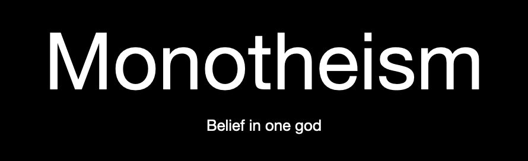

### Secular: 
- Definition: Non-religious
- It is an idea that a person may belong to a certain religion but never practice it, or for example a secular state that separates its laws 
from the UN...etc.. rather than a certain religion 
- This is related to what we are learning as there are many states that separate religion from state or many students in our class who are 
secular

### Liberal:
- Definition: More progressive
- It is an idea that a person may be a liberal or more progressive in things and not traditional and more open-minded 
- It relates to what we are learning as sometimes being more open-minded is good for understanding someone else's point of view

### Conservative:
- Definition: More traditional
- It is an idea that a person is more traditional and sticks to some beliefs like a very religious person or something
- It relates to what we are learning as there are a lot of conservatives in the world, maybe even more than liberals

### Marginalized:
- Definition: Excluded group?
- It is an idea in which no person can interfere with the state
- It relates to what we are learning as there are some countries like North Korea who pratice this

### Sect:
- Definition: A sub-section of a bigger religious group
- It is an idea, for example in Islam, the division between Sunni and Shia is mainly just different political views, Sunnis say that the caliph
which is the Islamic ruler and the order it was in was fine but Shias argue that the Islamic ruler should have been Ali RA instead of Abu Bakr
RA
- This relates to what we are learning as there are a lot of sects in some of the major religions

### Agnostic:
- Definition: Someone who believes in a higher entity 
- It is an idea, for example most people believe that there is a higher entity but they don't necessarily follow a certain religion
- It relates to what we are learning as we are studying about religion and culture

### Monotheism:
- Definition: Belief in 1 god
- It is an idea, that there is only 1 god not multiple
- This relates to what we are learning as most major religions believe in one god 

### Polytheism:
- Definition: Belief in multiple gods
- It is an idea, that there is not 1 god but multiple
- This relates to what we are learning as there religions that believe in multiple gods 

